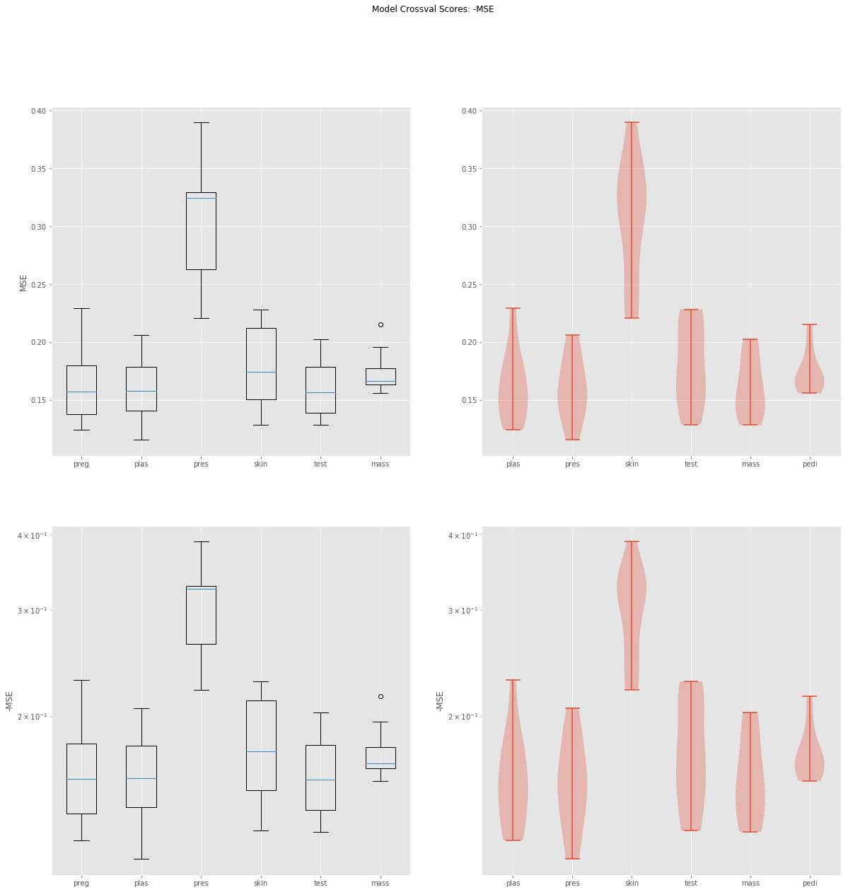
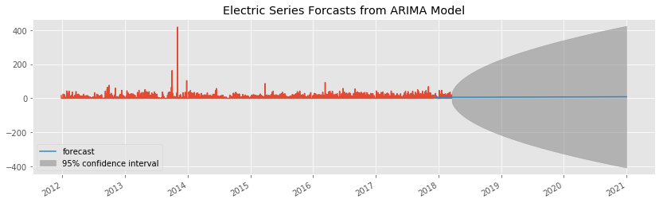
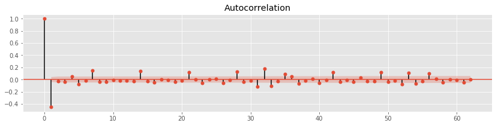
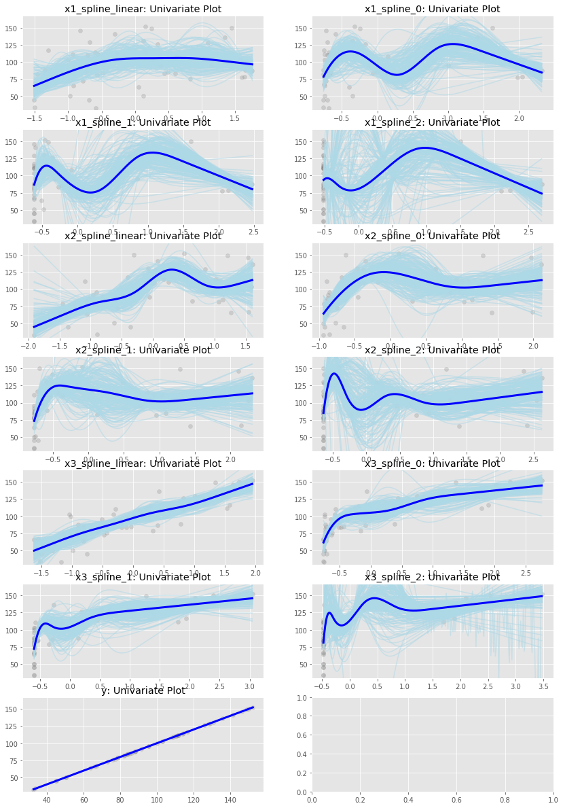

# Autoregression

Clean, graph, and model your data in one command.

Automatically assess and test multiple working
machine learning techniques:

    import autoregression
    autoregression.compare_predictions(df, 'y_var')


## Installation

A `setup.py` file is included. To install run:

```bash
pip install autoregression
    ```

or

```bash
git clone https://github.com/pgeurin/autoregression
pip install -e autoregression/
    ```
for an editable, most current version.

## Galgraphs
A library of graphing functions.

Graphs with ax take a axis from matplotlib.
Use pattern matplotlib 'fig, ax = subplots(1,1)' for best effect.

Graphs without an 'ax' input plot themselves.

The code used here HEAVILY relies upon the foundational work of Matt Drury.
This project just wouldn't exist without it.
This work is only possible because of the developers of matplotlib, pandas and Numpy.





## Cleandata
Cleans pandas dataframes using modern machine learning practices.

Turn first to clean_df(). It's your friend in a world of darkness.
It detects all manner of unmentionable values and replaces them with the mean or
distinguishing feature.


## Timeseries
Forcasts using ARIMA modeling techinques.

Turn first to make_arema_prediction(). It will take care of you.
If your data is a event-timestamp, rather than an event series, convert your data with timestamp_events_to_timeseries().





## Versioning

0.0.1 - Working graphs.
0.0.2 - Documentation.
0.0.3 - More graphs.
0.0.4 - Cleaning. AutoRegression.

## More Graphs:



